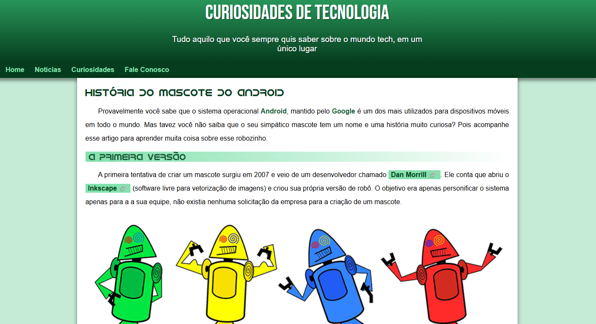
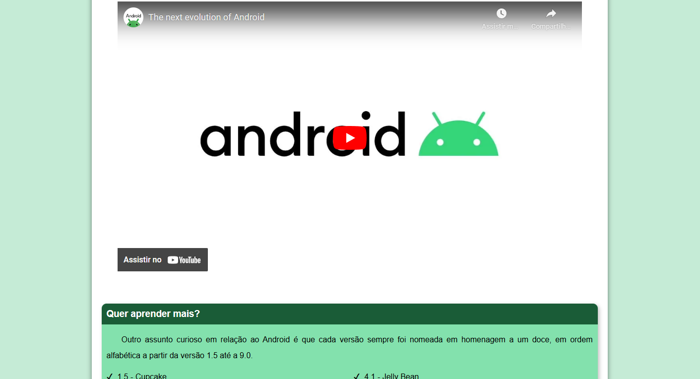
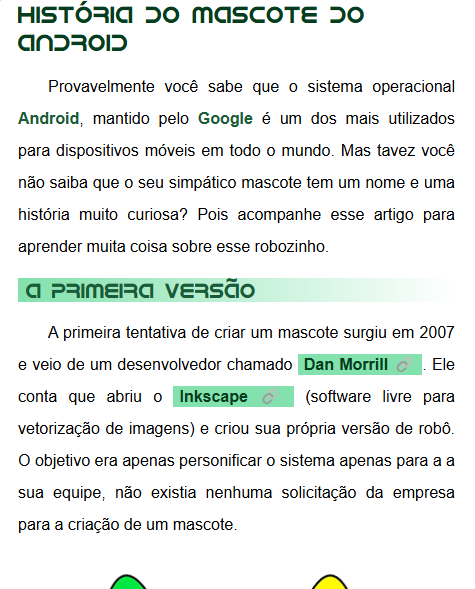
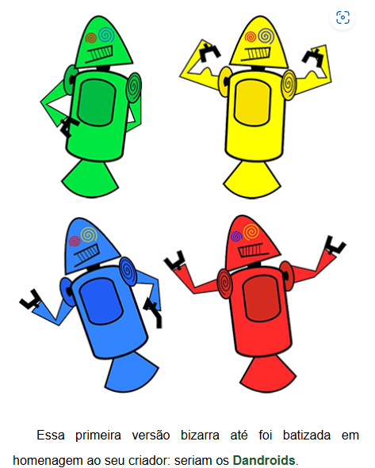

<h1 align="center" style="font-weight: bold;">Página Estática Android📱</h1>
<p align="center">
 <a href="#tecnologias-utilizadas">Tecnologias</a> • 
 <a href="#clonando-o-repositório">Clonando Repositório</a> • 
  <a href="#pré-requisitos">Pré-requisitos</a> •
</p>

<p align="center">
    <b>Página web estática com cabeçalho, tons de degradê, menu simples e um artigo com títulos, imagens, vídeo e um conteúdo relacionado.</b>
</p>

<p align="center">
     <a href="https://viktor1v9.github.io/mini-projeto/android" target="_blank">📱 Visit this Project</a>
</p>

<h2 id="layout">🎨 Layout</h2>

<p align="center">
    
    
        
    
</p>

## Tecnologias utilizadas 
[](https://skillicons.dev)

## Pré-requisitos 
- Browser que tenha compatibilidade com imagens no formato PNG e JPG.

## Clonando o repositório

```bash
git clone https://github.com/viktor1v9/mini-projeto.git
```
## Licença 
Este software está disponível sob as seguintes licenças:
- [MIT](LICENSE)